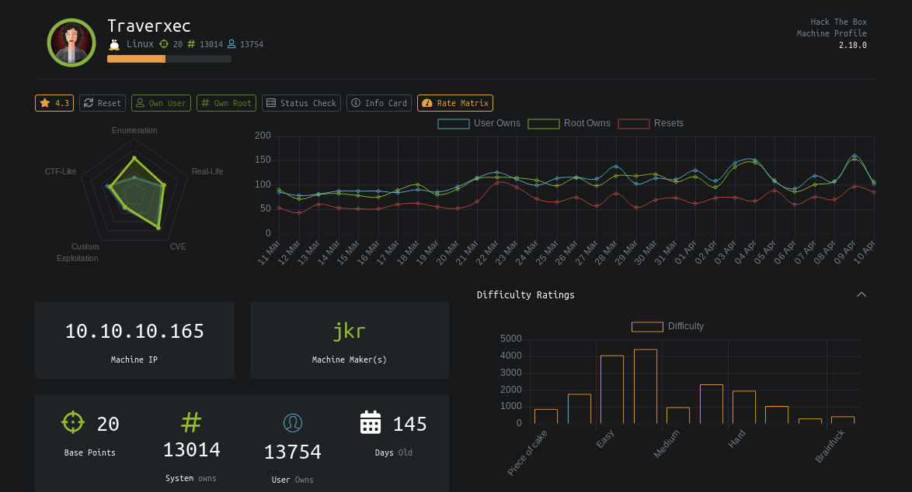
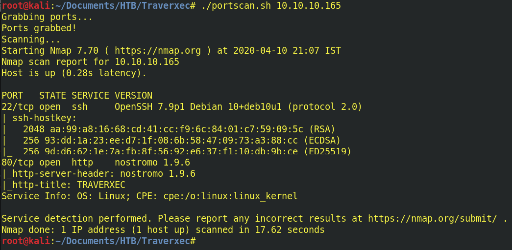

# Hack The Box - Traverxec - Writeup by <a href="https://montyshyama.me/">Monty Shyama</a>

<p align="center">
  
</p>

# Enumeration

Run a Full Nmap Scan to find all the open ports & the services associated with them.

```
#!/bin/bash
echo Grabbing ports...
ports=$(nmap -p- --min-rate 1000 -T4 $1 | grep ^[0-9] | cut -d '/' -f 1 | tr '\n' ',' | sed s/,$//)  
echo Ports grabbed!
echo Scanning...
nmap -sC -sV -Pn -p $ports $1 $2 $3
```

<p align="center">
  
</p>

Port 80 contains a webpage. A usual Directory brute-forcing on the page shows nothing interesting to work upon.

<p align="center">
  
</p>

The Nmap scans also reveals that it is running Nostromo Web Server (Version: 1.9.6). 
This version contains Directory Traversal Remote Command Execution Vulnerability.

# Foothold


